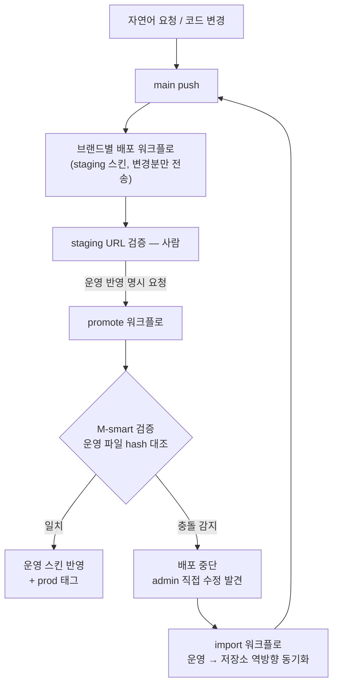

# Cafe24 멀티브랜드 모노레포 운영 체계

> 13개 D2C 브랜드의 Cafe24 자사몰 스킨을 한 저장소에서 버전 관리하고, 검증된 파이프라인으로 staging → 운영에 반영하는 운영 체계.

- **팀 규모**: 자사몰 운영 1인 전담 (도입 전: 퍼블리셔 3인이 4개 브랜드씩 분담)
- **참여도**: 파이프라인·운영 체계 설계 및 구축 100%

## 문제

Cafe24 스킨은 원래 admin 에디터나 FTP로 직접 고친다. 브랜드가 13개가 되면서 "누가 언제 무엇을 바꿨는지" 이력이 없고, 운영 사이트를 직접 건드리다 실수가 나도 되돌릴 기준이 없었다. 이 체계는 **스킨 코드를 git으로 옮기고, 사람의 실수를 파이프라인이 막아주는 구조**를 만든 결과물이다.

## 시스템 아키텍처

자세한 구조는 [docs/architecture.md](./docs/architecture.md) 참고.

## 주요 기능

- **push 자동배포 ×13** — 브랜드 폴더 변경 시 해당 브랜드만 staging 스킨에 incremental 배포 (수 초)
- **staging-first + 명시적 promote** — 운영 반영은 사람이 명시적으로 실행할 때만, hash 대조 게이트를 거쳐서
- **AI 처리 절차(Claude Code 스킬 ×13)** — 브랜드별로 자연어 요청 → recipe 매칭 → 수정 → 배포 절차를 스킬로 정의, 처리한 요청은 recipe로 자동 누적
- **Slack 접수 에이전트 파이프라인** — 타팀 요청의 접수→AI 처리→staging→운영 확정까지 무인화하는 설계 + MVP 엔진 코드 (Slack 연동 활성화는 대기, [설계 문서](./docs/slack-agent-pipeline.md))
- **디자인 시스템 동기화** — 라이브 페이지를 Figma로 추출하는 자체 도구(h2f) + 디자인 토큰 표준화
- **Cafe24 전용 가드** — phantom 파일(대소문자 중복)·drift·dead partial을 배포 전 게이트로 차단

자세한 설명은 [docs/main-features.md](./docs/main-features.md) 참고.

## 맡은 역할

- 스킨 코드의 git 이관 및 모노레포 구조 설계
- 브랜드별 자동배포·promote·import 워크플로(GitHub Actions + lftp) 작성
- 가드 스크립트(Python) 및 운영 규율 문서 체계 설계
- Claude Code 스킬 13종·recipe 체계 설계 (자연어 요청의 AI 처리 절차)
- h2f(HTML→Figma) 캡처 도구 및 디자인 토큰 파이프라인 구현
- Slack 접수 에이전트 파이프라인 설계 및 MVP 엔진 코드 작성 (실운영 활성화 대기)

## 성과

- **퍼블리셔 3인이 4개 브랜드씩 분담하던 운영을 1인 전담으로 전환**
- 배포 이력·리뷰 부재 → 모든 변경이 git 이력 + staging 검증 + 승인 게이트를 거치는 구조로
- 파일 몇 개 수준의 변경은 push 후 수 초 내 staging 반영 (incremental 배포)

## 문서

| 문서 | 내용 |
|---|---|
| [architecture.md](./docs/architecture.md) | 저장소 구조, 배포 파이프라인, 구조적 격리 |
| [tech-stack.md](./docs/tech-stack.md) | lftp·GitHub Actions·Claude Code 등 선택 이유 |
| [main-features.md](./docs/main-features.md) | 주요 기능 상세 |
| [troubleshooting.md](./docs/troubleshooting.md) | Cafe24 종특 함정과 해결 과정 |
| [slack-agent-pipeline.md](./docs/slack-agent-pipeline.md) | Slack 접수 에이전트 설계 문서 |
