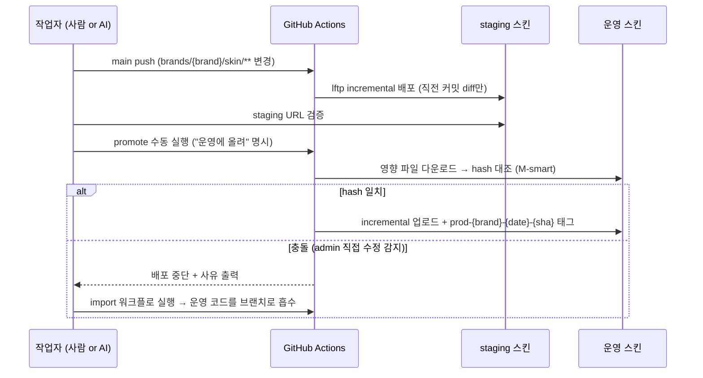

# 시스템 아키텍처

## 저장소 구조 — 구조적 격리

```
brands/{brand}/
├── skin/              ← Cafe24 스킨 코드 (배포 대상은 이 폴더만)
└── design-system/     ← mapping.yaml(스킨번호·recipe·Figma 매핑), 디자인 토큰 (배포 안 됨)
.github/workflows/
├── deploy-{brand}.yml     ← push 자동배포 (staging, incremental) ×13
├── promote-to-prod.yml    ← 명시 실행 (운영, M-smart 검증 + prod 태그 + 삭제 확인 게이트)
└── import-prod-skin.yml   ← 운영 → 저장소 흡수 (역방향 동기화)
scripts/               ← 가드 스크립트, 브랜드 온보딩, h2f 캡처 도구
snippet/               ← WebP 최적화 스니펫 단일 소스
.claude/skills/        ← 브랜드별 AI 처리 절차 ×13
```

핵심은 **배포 경로의 구조적 격리** — FTP 배포 소스는 `brands/{brand}/skin/` 하나뿐이다. 설계 문서·매핑·토큰이 아무리 바뀌어도 운영 사이트에 영향을 줄 수 없는 구조를 폴더 수준에서 강제한다.

## 배포 파이프라인



### staging-first 절대 원칙

- 모든 변경은 무조건 staging 스킨에 먼저 배포된다
- 운영 반영은 (1) staging 검증 완료 + (2) 사람의 명시적 promote 실행, 두 조건이 모두 충족될 때만
- AI에게는 자동 promote·의도 추정이 금지되어 있다 — 절차가 아니라 **구조로** 막는다

### promote의 안전 장치

| 장치 | 막는 사고 |
|---|---|
| M-smart 검증 (운영 파일 hash 대조) | admin에서 몰래 고쳐진 파일을 모르고 덮어쓰는 것 |
| prod 태그 (배포 기준점 기록) | 다음 promote의 diff 기준 상실 |
| 기준 커밋 불명 시 **실패** (자동 full 전환 금지) | 의도치 않은 전체 덮어쓰기 |
| 삭제 포함 full mirror에 별도 확인 입력 요구 | 운영 파일 대량 삭제 |

### 역방향 동기화 (import)

운영에서 admin 직접 수정은 어차피 발생한다. 이를 금지하는 대신:

1. 수정 발생 시 import 워크플로가 운영 스킨을 브랜치로 내려받아 저장소에 흡수
2. **동기화를 잊어도** 다음 promote의 M-smart가 hash 충돌로 잡아낸다

규율(사람의 기억)에 의존하지 않고 파이프라인이 잡는 구조가 설계의 중심이다.

## 운영 문서 체계 — "사본은 낡는다"

- **CURRENT.md** — 현재 유효한 결정·절차·확정값의 단일 진실. 절차가 바뀌면 그 자리에서 갱신 + 옛 서술 삭제가 변경 작업의 일부
- **문서와 실물이 다르면 실물이 이긴다** — 발견 즉시 문서를 실물에 맞춰 정정
- 스킨 번호 같은 가변 값은 문서에 복제하지 않고 브랜드별 `mapping.yaml` 한 곳에서만 관리, 실행 시점에 읽는다
