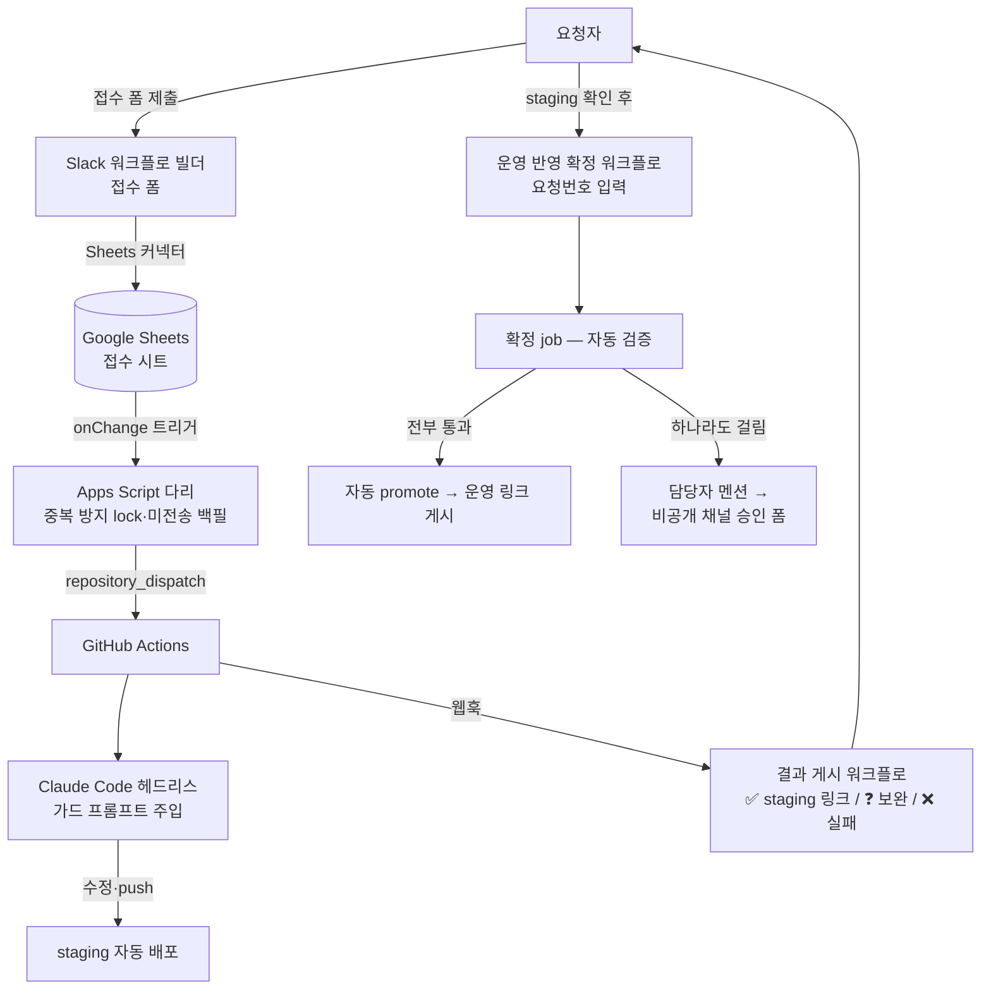

# Slack 접수 에이전트 파이프라인 — 설계 문서

> 타팀의 몰 수정 요청이 "Slack DM → 담당자 복붙 → AI 처리 → 회신"으로 흐르던 **사람 중간다리를 제거**하려는 자동화. **현재 단계: 설계 확정 + 실측 검증 + MVP 처리 엔진(GAS 다리·Actions 워크플로·가드 프롬프트) 코드 작성 완료. Slack 접수 연동 활성화(채널·빌더 워크플로·시크릿 설정)는 미착수.**

## 제약이 곧 설계였다

커스텀 Slack 앱은 조직 정책상 관리자 승인 대상이었다. 승인을 기다리는 대신, **조직이 공식 권장하는 내장 워크플로 빌더만으로** 접수·회신을 구성했다 — 승인 대기 0, 상시 서버 0, 추가 비용 0.

수용한 트레이드오프: 스레드 자유 대화 불가 → 정보 부족 시 "보완 재제출 요청" 방식. 몇 주 운영 실적을 근거로 앱 승인을 요청하는 발판으로 삼는 단계적 전략.

핵심 실측(0단계): 워크스페이스에 "웹 요청 보내기" 스텝이 **없다**는 걸 확인 → Slack에서 밖으로 직접 호출하는 설계를 폐기하고, **Sheets 커넥터 + Apps Script 트리거를 다리로** 쓰는 아키텍처로 확정했다. 설계를 문서로 확정하기 전에 가정을 전부 실측으로 검증한 것이 이 프로젝트의 진행 방식이다.

## 아키텍처



**평상시 운영 반영에 담당자 개입 0** — 요청자가 스스로 확정하면 자동 검증(①확정자 = 원 요청자 본인 ②해당 브랜드 대기 변경이 이 건뿐 ③민감 유형 아님)을 거쳐 promote까지 완결된다. 예외만 담당자에게 멘션이 가고, 모바일 3탭으로 승인한다.

## 접수 폼 설계 — 실요청 분석 기반

수 주간의 실제 요청(커밋 40여 건 + recipe 30종 + DM 원문 15건)을 분석해 유형을 도출했다: 상품별 표기 켜기/끄기(최다), 문구 변경, 이미지 교체, 링크 변경, 쿠폰·프로모션, 질문성 문의, 긴급 복구.

처음엔 유형 분류·대상 위치·기한 필드를 두려 했으나, **실사례 전부가 자유 서술에서 해석 가능**함을 확인하고 필수 항목을 2개로 줄였다:

| 항목 | 형식 | 근거 |
|---|---|---|
| 브랜드 | 드롭다운 | 단일 채널 운영이므로 분류 필수. 에이전트의 브랜드 잠금·큐의 기준 |
| 요청 내용 | 장문 텍스트 (placeholder로 작성 가이드) | 유형·대상·기한 모두 AI가 자유 서술에서 해석 |

선택 항목: 질문·문의 체크박스(질문인데 수정해버리는 사고 방지), 파일 첨부, 참고 링크.

정보 부족은 **staging 진입 전, 수정 0 상태에서** 판정해 "❓ 보완 재제출"로 즉시 종결한다(큐 점유 없음). 재제출 시 바뀐 부분만 적으면 AI가 요청 원장에서 원 본문을 찾아 합쳐 해석한다.

## 동시성 정책

**브랜드 간 병렬 / 브랜드 내 직렬(큐)**, 큐 진행 기준 = 앞 요청의 종결(운영 반영 완료 or 취소).

- 근거: 같은 브랜드 병렬 처리는 git 충돌(실사례: 같은 날 같은 파일 수정 2건)·staging 검증 혼선·promote 얽힘을 유발
- 종결 기준 직렬화로 "확정 대기 다건이 쌓이는" 시나리오가 원천 소멸 — staging엔 항상 1건만 존재
- **잠수 방지**: staging 게시 후 일정 시간 무확정 → 자동 리마인더 → 그래도 무응답이고 뒤 요청이 대기 중이면 담당자 벨 → 승인 또는 취소(자동 revert) → 다음 요청 진행
- **추가 요건 병합**: 확정 전 같은 요청자가 같은 브랜드로 재제출하면 새 건이 아니라 기존 건에 병합 — promote가 브랜드 단위이므로 병합 단위와 확정 단위가 정확히 일치

## 트리아지 — 오판의 무해화 4겹

자동 처리 대상(결과가 명확한 반복 요청, 실요청의 약 8할)과 수동 대상(신규 기능·UX 튜닝·다파일 인프라)을 나누되, **판정 정확도를 올리는 것보다 오판이 무해하도록** 설계했다:

1. **비대칭 기준** — 애매하면 수동 전환 (수동 전환의 비용은 0, 잘못된 자동 처리의 비용은 크다)
2. **기계적 가드** — diff가 파일 수·줄수 상한을 넘으면 AI 판단과 무관하게 강제 수동 전환
3. **구조적 격리** — 오판해도 staging까지만 도달, 운영은 확정 게이트 뒤
4. **단계적 확대** — MVP는 최다 빈도 3유형(표기 토글·문구·링크)만 자동, recipe 실적 기반으로 확대

## 에이전트 가드 (개념 재구성)

헤드리스 AI 실행 시 주입되는 가드 규칙의 골자 (실제 프롬프트의 개념 요약):

```text
절대 규칙 (위반 = 즉시 수동 전환)
1. staging만: 커밋은 해당 브랜드 스킨 폴더 하위만, promote 직접 실행 금지
2. 브랜드 잠금: 커밋 전 git diff --name-only로 자가 검증,
   폼에서 지정한 브랜드 밖 파일이 있으면 전부 되돌리고 수동 전환
3. 수정 금지 대상: 플랫폼 모듈 변수, admin 설정 영역, 워크플로·스크립트 자체
4. 비밀 금지: 자격증명을 출력·커밋·회신문에 포함하지 않는다
5. 무소음 실패 금지: 어떤 실패도 ❌ 회신으로 표면화, 조용한 종료 금지

처리 순서: 해석(질문/병합/보완/code·admin 분기/트리아지/정보부족 판정, 수정 0 상태에서)
  → recipe 우선 수정 → 기계 가드 자가 검증 → staging 응답 실측 확인 → 회신문 작성
회신문은 전문용어 없이 — 요청자는 개발자가 아니다.
```

## 단계별 계획과 검증

| 단계 | 내용 | 상태 |
|---|---|---|
| 0단계 | 워크플로 빌더 기능 실측 (웹 요청 스텝 부재 확인 → 아키텍처 확정) | ✅ 완료 |
| 1단계 (MVP) | 처리 엔진 코드(GAS 다리·Actions 워크플로·config·가드 프롬프트) 작성 | 코드 작성 완료 · Slack 연동 활성화 대기 |
| 2단계 | 확정 워크플로 활성 + 전 브랜드 + 이미지 유형 | 미착수 |
| 3단계 | 운영 실적 기반으로 커스텀 앱 승인 요청 → 스레드 대화로 업그레이드 | 조건부 |

> **현황 요약**: 설계와 MVP 엔진 코드는 저장소에 커밋돼 있으나, Slack 접수 연동을 실제로 켜는 1회성 설정(채널 생성·빌더 워크플로 제작·시크릿 등록)이 남아 있어 아직 운영에 붙지 않았다. 즉 "설계·엔진 완성 / 실운영 활성화 대기" 상태.

검증 계획: 실사례를 재현한 E2E(접수→staging→결과 게시), 보완 흐름, 브랜드 잠금 가드 위반 시나리오, 승인 E2E를 각각 통과 기준과 함께 정의(활성화 시 수행).
