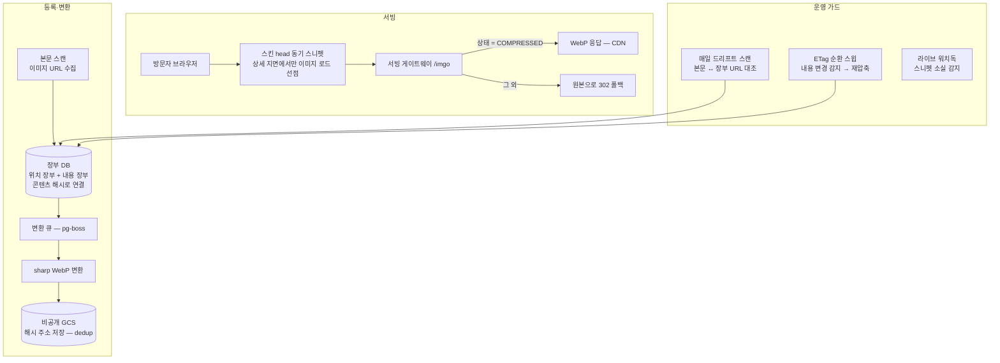

# Cafe24 상품 이미지 WebP 자동 변환 앱

> Cafe24 쇼핑몰의 상품 상세 본문 이미지를 WebP로 자동 최적화하는 풀스택 앱. **본문 HTML은 절대 건드리지 않고(clean-body), 언제든 DB 상태 변경만으로 즉시 되돌릴 수 있는** 구조가 설계의 중심.

- **팀 규모**: 1인 (풀스택 설계·개발 100%)

## 문제

모바일에서 상품 상세페이지가 눈에 띄게 느렸다. 원인은 본문에 박힌 원본 이미지(JPG/PNG)가 그대로 서빙되는 것 — Cafe24는 본문 이미지를 최적화해주지 않는다. 그런데 **운영 중인 쇼핑몰**이므로, 본문을 고치는 순간 에디터 호환이 깨지고 되돌릴 수 없게 된다. "최적화하되 원본과 본문은 불가침"이 요구사항이 됐다.

## 시스템 아키텍처

자세한 구조는 [docs/architecture.md](./docs/architecture.md) 참고.

## 주요 기능

- **원클릭 압축** — 본문 스캔 → 자산 등록 → WebP 변환 → 해시 주소 저장(같은 이미지 중복 변환 0)
- **무오염 서빙** — 본문 write 경로 자체가 없음. 스니펫이 이미지 로드를 선점해 교체, 원본 요청은 전송 전 취소
- **롤백 = 상태 스위치** — 서빙 게이트웨이가 "변환 완료" 상태만 WebP로 응답, 나머지는 원본 폴백. 롤백·재최적화가 DB 상태 변경만으로 발효
- **드리프트 대응** — 디자이너의 에디터 교체·삽입을 매일 스캔으로 감지(신규 자동 압축·재매핑·orphan 마킹), FTP 같은 파일 덮어쓰기는 CDN ETag 지문으로 감지
- **스니펫 3계층 가드** — 단일 소스 주입 → 배포 게이트 → 라이브 워치독

자세한 설명은 [docs/main-features.md](./docs/main-features.md) 참고.

## 맡은 역할

- 무오염(clean-body) 아키텍처 설계 — 본문 불가침·상태 스위치 서빙·장부 분리
- NestJS 백엔드(스캔·변환 큐·서빙 게이트웨이·드리프트 스캔) 구현
- Next.js 관리자 UI(운영 상태 대시보드·수동 제어) 구현
- 스킨 스니펫(브라우저 측 로드 선점) 구현 및 [모노레포](../cafe24-mall-monorepo/) 배포 게이트 연동

## 성과

- **평균 84% 용량 절감** — 실측 124.93MB → 20.03MB
- 롤백 소요: 본문 수정 0회, DB 상태 변경만으로 즉시 (실증)

## 문서

| 문서 | 내용 |
|---|---|
| [architecture.md](./docs/architecture.md) | clean-body 구조, 장부 설계, 서빙 게이트웨이 |
| [tech-stack.md](./docs/tech-stack.md) | NestJS·pg-boss·sharp·GCS 선택 이유 |
| [main-features.md](./docs/main-features.md) | 주요 기능 상세 |
| [troubleshooting.md](./docs/troubleshooting.md) | 드리프트·워커 사망·식별 체계 전환 사례 |
