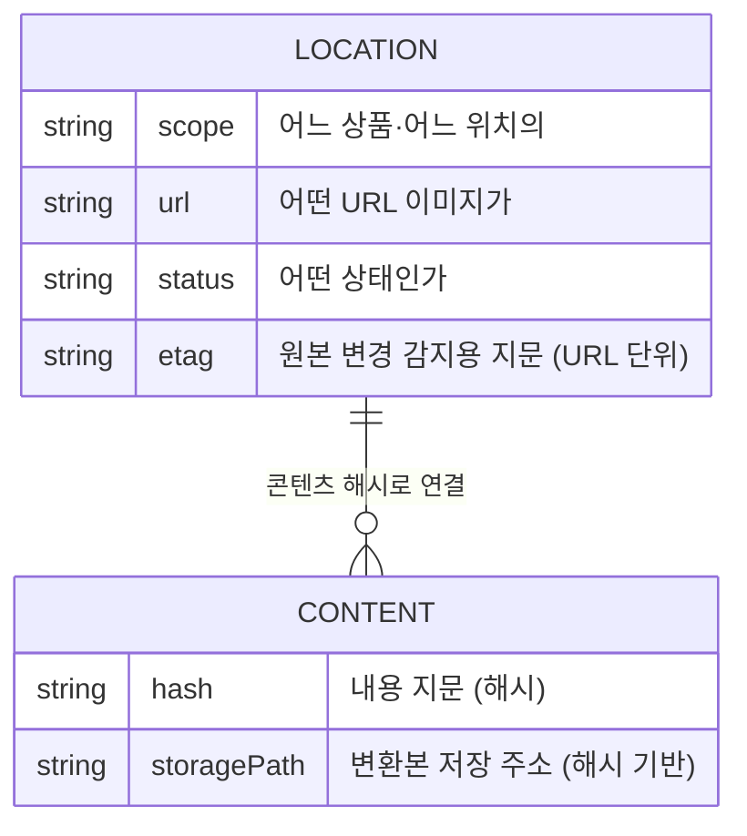

# 시스템 아키텍처

## 무오염(clean-body) 원칙

본문 HTML은 **영구 생 원본**이다 — 코드에 본문 write 경로 자체가 존재하지 않는다("본문 영구 불가침"). 대신:

1. 스킨 head 최상단의 **동기 스니펫**이 상품 상세 지면에서만 이미지 로드를 선점해 서빙 게이트웨이 URL로 교체
2. 원본 요청은 전송 전에 취소됨(실측: ERR_ABORTED 0KB) — 실제 전송량은 WebP뿐
3. 변환 제외 형식(gif/svg)은 건드리지 않고, 미최적화로 판명된 이미지는 로드 후 src를 원본으로 복원 — **DOM의 src가 곧 실제 서빙 내용**이라는 일관성 유지

이 구조의 파급 효과: 본문을 쓸 일이 없으므로 플랫폼 API 권한을 **읽기 전용 단일 scope**로 축소할 수 있었다. 권한 최소화가 기능 제약이 아니라 아키텍처의 결과가 된 사례.

## 장부(ledger) 설계

DB에는 이미지가 아니라 **"무엇을 최적화했고 어떻게 되돌리는지"** 만 기록한다.



- **위치의 장부**(이 상품 본문의 이 이미지)와 **내용의 장부**(이 바이트열의 변환본)를 분리하고 콘텐츠 해시로 연결
- 같은 이미지가 여러 상품에 쓰이면 변환은 한 번 — 저장도 해시 주소(content-addressed)라 구조적으로 dedup

## 서빙 게이트웨이 — 상태가 곧 스위치

```
요청 → /imgo 게이트웨이
        ├─ 자산 상태 = COMPRESSED → WebP 응답 (CDN 캐시)
        └─ 그 외 (미등록·변환중·롤백됨) → 원본으로 302 폴백
```

- 롤백↔재최적화가 **DB 상태 변경만으로 즉시 발효** (본문 수정 0회, 실증됨)
- 미등록 이미지도 302 폴백이라 화면은 항상 정확 — 실패 모드가 "느려짐"이지 "깨짐"이 아님

## 드리프트 대응 — 시스템 밖의 변경 감지

시스템이 모르는 변경은 두 종류이고, 각각 다른 지문으로 잡는다:

| 변경 유형 | 감지 방법 |
|---|---|
| 에디터로 이미지 교체·삽입 (URL이 바뀜) | 매일 새벽 본문과 장부를 URL로 대조 — 신규 등록(자동 압축)·위치 재매핑·orphan 소프트 마킹 |
| FTP로 같은 파일 덮어쓰기 (URL 그대로, 내용만 바뀜) | CDN ETag가 콘텐츠 MD5임을 실측 확인 → 순환 HEAD 점검으로 내용 변경을 잡아 재압축 |

## 스니펫 3계층 가드

스킨 리뉴얼로 스니펫이 조용히 사라지면 최적화 전체가 무효가 된다. 세 겹으로 방어:

1. **단일 소스 주입** — 스킨 저장소([모노레포](../../cafe24-mall-monorepo/))에서 템플릿 하나로 일괄 주입
2. **배포 게이트** — promote 시 마커 검사, 누락이면 배포 중단
3. **라이브 워치독** — 매일 몰별 상세 페이지를 PC·모바일 UA로 실제 조회해 마커 존재 확인, 소실 시 error 로그
