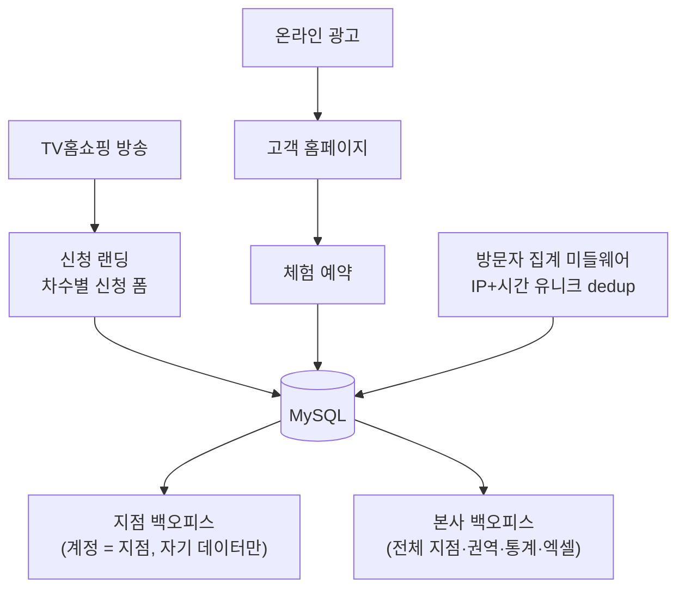

# 칼로리바 — 고객 홈페이지 + 지점 백오피스

> 다이어트·체형관리 프랜차이즈의 고객 홈페이지와 본사·지점 백오피스. TV홈쇼핑·온라인 광고로 유입된 체험 예약이 수십 개 지점(직영+가맹)으로 나뉘어 들어오는 구조에서, 고객 랜딩부터 관리 화면까지 **모객 전 과정을 하나의 운영 체계로** 구축.

- **참여도**: 65% — 프론트엔드·백엔드 신규 개발 및 유지보수

## 시스템 아키텍처

## 주요 기능

- **"계정 = 지점" 설계** — 고객 회원가입 없이 로그인 계정 자체를 지점 엔티티로. 지점은 자기 데이터만, 본사는 전체를 보고, 미확인 건수를 사이드바 배지로 상시 노출
- **홈쇼핑 신청 시스템 & 다채널 확장** — 차수(round) 개념으로 방송 회차별 데이터를 분리, 신규 홈쇼핑 채널 추가 시 기존 신청 데이터 **1,849건을 손실 없이 마이그레이션**. 신청 가능 차수는 허용 리스트 한 줄로 제어
- **방문자 통계** — Django 미들웨어에서 요청을 가로채 IP+시간 단위 유니크 제약으로 중복 제거, 일별·30일 평균을 관리자 페이지에서 확인
- **권역 관리** — 지점을 권역으로 묶는 다대다 구조와 CRUD로 권역별 예약 관리·지역 마케팅 지원
- **엑셀 다운로드** — 관리자 권한별 필터링을 적용한 구매 데이터 내보내기
- **운영 DB 보호** — 로컬 개발은 환경 변수 하나로 빈 SQLite 구동으로 분리, 운영 데이터 오염 원천 차단

자세한 설명은 [docs/main-features.md](./docs/main-features.md) 참고.

## 맡은 역할

- 홈쇼핑 신청 시스템(차수 모델·다채널 확장·데이터 마이그레이션) 설계·개발
- 방문자 집계 미들웨어, 권역 관리 CRUD, 엑셀 다운로드 개발
- 고객 홈페이지·백오피스 화면 퍼블리싱 및 프론트 개발

## 성과

- 신규 홈쇼핑 채널 추가 시 기존 신청 데이터 **1,849건 무손실 마이그레이션**
- 방송 회차별 신청 데이터 분리로 운영팀의 회차 관리 수작업 제거

## 문서

| 문서 | 내용 |
|---|---|
| [architecture.md](./docs/architecture.md) | 계정=지점 모델, 차수 데이터 모델 |
| [tech-stack.md](./docs/tech-stack.md) | Django·MySQL 선택과 환경 분리 |
| [main-features.md](./docs/main-features.md) | 주요 기능 상세 |
| [troubleshooting.md](./docs/troubleshooting.md) | 무손실 마이그레이션·중복 집계 해결 |
