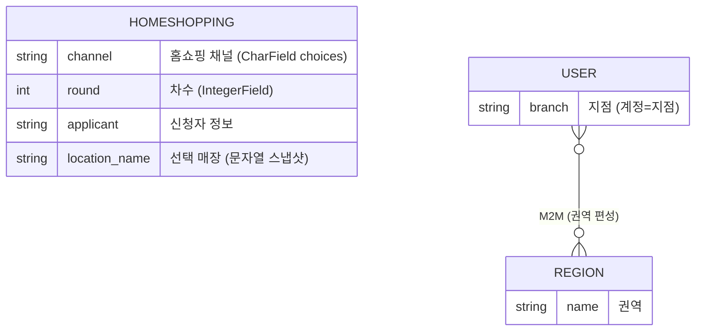

# 시스템 아키텍처

## "계정 = 지점" 모델

이 서비스의 사용자는 소비자가 아니라 **지점**이다. 고객은 회원가입 없이 신청·예약만 남기고, 로그인 계정 자체를 지점 엔티티로 설계했다:

- 지점 계정 → 자기 지점으로 배정된 신청·예약만 조회
- 본사 계정 → 전체 지점 데이터 + 통계 + 권역 관리
- 미확인 신청 건수를 사이드바 배지로 상시 노출 — 지점이 로그인만 하면 처리할 일이 보이는 구조

계정과 지점을 분리(회원-프로필 구조)하는 일반 설계 대비, 도메인상 "지점 외 사용자"가 존재하지 않는다는 사실을 받아들여 모델을 단순화한 선택.

## 홈쇼핑 신청 데이터 모델 — 채널·차수 축

별도 테이블을 만드는 대신, 신청 엔티티 하나에 **채널·차수를 축(컬럼)으로** 얹는 방식을 택했다.

- 신청은 단일 `Homeshopping` 모델에 `channel`(CharField·choices) + `round`(IntegerField) 컬럼 + 복합 인덱스로 관리 — 별도 Channel/Round 테이블 없음
- 회차별 참여 매장 라인업은 DB 관계가 아니라 정적 파이썬 데이터(`get_locations(channel, round)`)로 관리
- 신청 가능 차수는 뷰의 허용 리스트(`active_rounds`) 한 줄로 제어 — 방송 오픈/마감이 코드 한 줄 변경
- 신규 채널 추가는 마이그레이션(choices에 항목 추가) + 뷰·URL·템플릿·매장 데이터 추가가 필요하지만, **신청 로직 자체는 공용 폼 함수(`homeshopping_form`) 하나를 채널별로 래핑**해 중복 없이 확장한다

## 방문자 집계 — 미들웨어 계층

애플리케이션 코드에 집계 호출을 흩뿌리는 대신 Django 미들웨어에서 요청을 가로채 한 곳에서 처리:

- IP + 시간 단위 유니크 제약으로 중복 제거 (DB 제약이 dedup을 보장 — 애플리케이션 로직 아님)
- 일별 집계·30일 평균을 관리자 페이지에서 제공

## 환경 분리 — 운영 DB 보호

로컬 개발은 환경 변수 하나로 빈 SQLite로 구동된다. 개발 중 실수로 운영 MySQL에 연결될 경로 자체를 없앤 설계 — "조심한다"가 아니라 "닿지 않게 한다".
