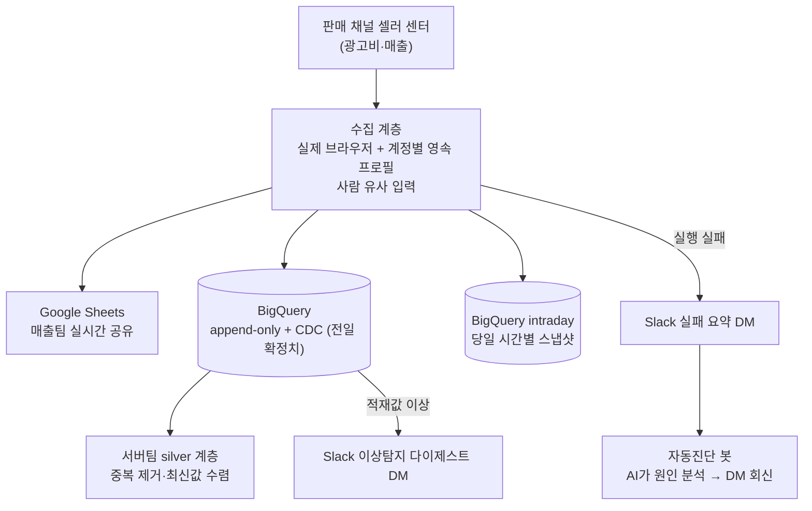

# 커머스 채널 데이터 수집 자동화 파이프라인

> 여러 커머스 채널에 흩어진 13개 브랜드의 광고비·매출을 매시간 자동 수집해 Google Sheets와 BigQuery에 적재하고, 실패하면 AI가 원인을 자동 진단해 Slack DM으로 회신하는 데이터 파이프라인.

- **참여도**: 75% — 파이프라인 설계·개발 (크롤러 / API 연동 / 적재 / 정합성 검증 / 자동진단 봇)

## 문제

담당자가 판매 채널의 광고센터·판매자센터를 매일 직접 들여다보며 브랜드별 매출·광고비를 수기 집계했다. 채널 한 곳은 공식 API가 없고 강한 봇 차단과 수시로 바뀌는 프론트 UI를 갖고 있어, 단순 스크립트로는 금방 막히거나 깨진다. 이 파이프라인은 **"차단을 넘고, UI 변화를 견디고, 틀린 값이 조용히 들어가는 걸 잡는"** 데 초점이 맞춰져 있다.

## 시스템 아키텍처

자세한 구조는 [docs/architecture.md](./docs/architecture.md) 참고.

## 주요 기능

- **채널별 수집 전략 분리** — API 미제공 채널은 실제 브라우저 기반 수집, 공식 API 제공 채널(정산)은 직접 연동
- **다중 적재** — 매출팀용 Sheets / 누적 분석용 BigQuery(전일 확정) / 당일 시간별 스냅샷 세 경로 분기
- **거짓 성공 방지** — 빈 표·스테일 값·우연히 맞는 합계 등 "성공처럼 보이는 실패"를 다층 검증으로 차단
- **두 층의 Slack 알림** — 실행 실패 요약과 적재값 이상 다이제스트를 분리 운영
- **실패 자동진단 봇** — 실패 알림을 AI(Claude Code 헤드리스)가 격리 환경에서 조사해 원인·수정안을 DM으로 회신 ([설계 문서](./docs/auto-diagnosis-bot.md))

자세한 설명은 [docs/main-features.md](./docs/main-features.md) 참고.

## 맡은 역할

- 봇 차단·UI 드리프트에 견디는 수집 계층 설계·구현
- BigQuery append-only + CDC 적재 구조 및 최소 권한 서비스 계정 설계
- 정합성 검증(거짓 성공 방지)·이상탐지 다이제스트 구현
- 실패 자동진단 봇 전체 설계·구현 (큐 → 디스패처 → 격리 진단 → DM 회신)
- 운영 배포 체계(git 기반, Windows 작업 스케줄러) 구축

## 성과

- **수기 집계 대비 일 2~3시간 절감** (13개 브랜드 자동 수집)
- 실패 원인 파악이 "사람이 스크린샷·로그를 여는 작업"에서 "AI 진단 DM을 받아 보는 것"으로 — 조사 루프 자체를 위임

## 문서

| 문서 | 내용 |
|---|---|
| [architecture.md](./docs/architecture.md) | 수집·적재·모니터링 계층 구조 |
| [tech-stack.md](./docs/tech-stack.md) | 실브라우저·BigQuery CDC·최소 권한 등 선택 이유 |
| [main-features.md](./docs/main-features.md) | 주요 기능 상세 |
| [troubleshooting.md](./docs/troubleshooting.md) | 봇 차단·셀렉터 드리프트·데이터 정합성 사례 |
| [auto-diagnosis-bot.md](./docs/auto-diagnosis-bot.md) | 실패 자동진단 봇 설계 문서 |
