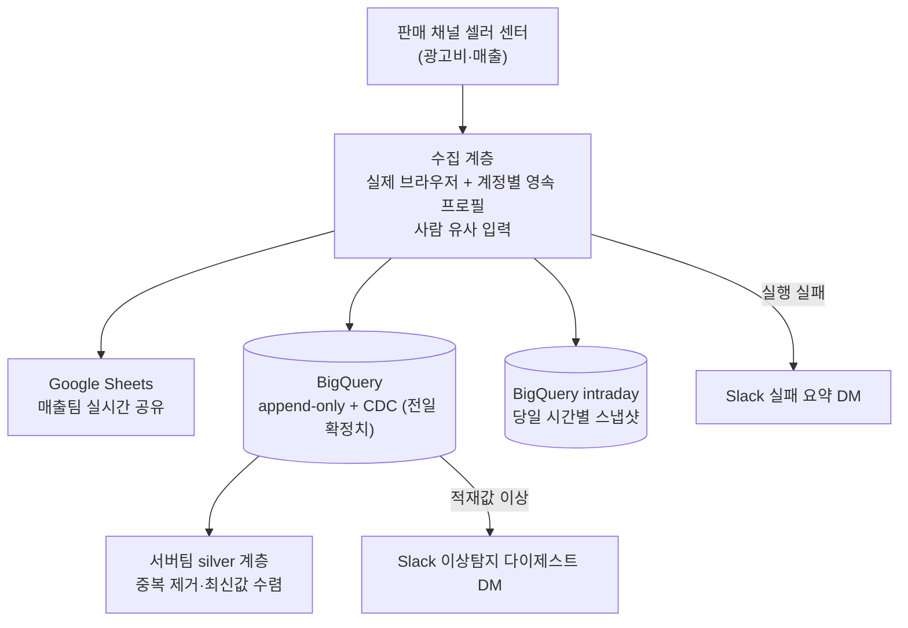

# 커머스 채널 데이터 수집 자동화 파이프라인

> 여러 커머스 채널에 흩어진 13개 브랜드의 광고비·매출을 매시간 자동 수집해 Google Sheets와 BigQuery에 적재하고, 적재 전 교차검증과 매일 아침 Slack 리포트로 정합성을 확인하는 데이터 파이프라인.

- **참여도**: 100% — 파이프라인 설계·개발 (크롤러 / API 연동 / 적재 / 정합성 검증)

## 문제

담당자가 판매 채널의 광고센터·판매자센터를 매일 직접 들여다보며 브랜드별 매출·광고비를 수기 집계했다. 채널 한 곳은 공식 API가 이미 주문 관리 솔루션(사방넷)에 연결돼 있어 같은 계정으로 추가 연동이 불가했고, 강한 봇 차단과 수시로 바뀌는 프론트 UI를 갖고 있어, 단순 스크립트로는 금방 막히거나 깨진다. 이 파이프라인은 **"차단을 넘고, UI 변화를 견디고, 틀린 값이 조용히 들어가는 걸 잡는"** 데 초점이 맞춰져 있다.

## 시스템 아키텍처

```mermaid
flowchart TD
    SRC["판매 채널 셀러 센터<br/>(광고비·매출)"] --> CR["수집 계층<br/>실제 브라우저 + 계정별 영속 프로필<br/>사람 유사 입력"]
    CR --> GS["Google Sheets<br/>매출팀 실시간 공유"]
    CR --> BQ[("BigQuery<br/>append-only + CDC (전일 확정치)")]
    CR --> IQ[("BigQuery intraday<br/>당일 시간별 스냅샷")]
    BQ --> SV["서버팀 silver 계층<br/>중복 제거·최신값 수렴"]

    CR -->|"실행 실패"| AL["Slack 실패 요약 DM"]
    BQ -->|"적재값 이상"| DG["Slack 이상탐지 다이제스트 DM"]
```

자세한 구조는 [docs/architecture.md](./docs/architecture.md) 참고.

## 주요 기능

- **채널별 수집 전략 분리** — API 연동이 이미 점유된 채널은 운영 중인 연동을 유지한 채 실제 브라우저 기반 수집, 공식 API를 쓸 수 있는 채널(정산)은 직접 연동
- **다중 적재** — 매출팀용 Sheets / 누적 분석용 BigQuery(전일 확정) / 당일 시간별 스냅샷 세 경로 분기
- **거짓 성공 방지** — 빈 표·스테일 값·우연히 맞는 합계 등 "성공처럼 보이는 실패"를 다층 검증으로 차단
- **두 층의 Slack 알림** — 실행 실패 요약과 적재값 이상 다이제스트를 분리 운영
- **교차검증 게이트** — 적재 전에 성과 그래프의 일별 시계열과 원 단위로 대조하고 캠페인 행수를 검증, 불일치면 적재 차단
- **아침 자동 Slack 리포트** — 전날 수집 결과를 매일 아침 Slack으로 자동 보고

자세한 설명은 [docs/main-features.md](./docs/main-features.md) 참고.

## 맡은 역할

- 봇 차단·UI 드리프트에 견디는 수집 계층 설계·구현
- BigQuery append-only + CDC 적재 구조 및 최소 권한 서비스 계정 설계
- 정합성 검증(거짓 성공 방지)·이상탐지 다이제스트 구현
- 운영 배포 체계(git 기반, Windows 작업 스케줄러) 구축

## 성과

- **수기 집계 대비 일 2~3시간 절감** (13개 브랜드 자동 수집)
- 적재 전 교차검증으로 "성공처럼 보이는 실패"를 차단하고, 매일 아침 Slack 리포트로 상태 확인에 드는 시간을 없앰

## 문서

| 문서 | 내용 |
|---|---|
| [architecture.md](./docs/architecture.md) | 수집·적재·모니터링 계층 구조 |
| [tech-stack.md](./docs/tech-stack.md) | 실브라우저·BigQuery CDC·최소 권한 등 선택 이유 |
| [main-features.md](./docs/main-features.md) | 주요 기능 상세 |
| [troubleshooting.md](./docs/troubleshooting.md) | 봇 차단·셀렉터 드리프트·데이터 정합성 사례 |
