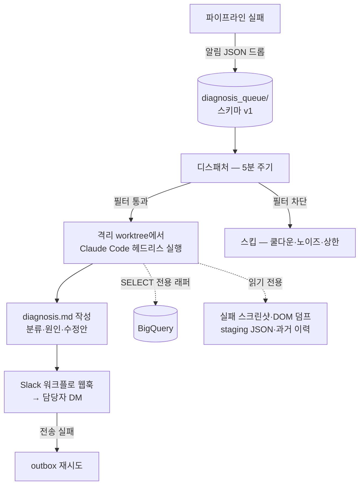

# 실패 자동진단 봇 — 설계 문서

> 파이프라인 실패 알림을 사람이 열어보기 전에, **AI(Claude Code 헤드리스)가 격리 환경에서 원인을 조사해 진단 리포트를 Slack DM으로 회신**하는 봇. 5단계로 나눠 구축하고 시나리오 시뮬레이션을 통과한 뒤 스케줄러에 등록했다.

## 왜 만들었나

실패 알림은 이미 오고 있었다. 문제는 그 다음 — 사람이 스크린샷을 열고, 로그를 뒤지고, 코드를 찾아보는 원인 조사 루프가 매번 반복됐다. 조사 절차 자체는 정형화되어 있었으므로(현장 증거 → 이력 대조 → 코드 확인 → 분류), 이 루프를 AI에 위임하되 **운영을 절대 건드릴 수 없는 격리** 안에서 돌게 했다.

## 아키텍처



## 5단계 구축

### 1단계 — 실패를 큐에 남기기

기존 실패 알림 경로에 한 줄 추가: 알림 내용을 `diagnosis_queue/`에 JSON(스키마 버전 포함)으로 드롭. 기존 파이프라인 동작은 전혀 바뀌지 않는다 — **관찰 계층을 먼저 만들고 처리 계층을 뒤에 붙이는** 순서.

### 2단계 — 디스패처 (진단 폭주 방지)

같은 실패가 반복되면 진단도 반복 낭비된다. 디스패처가 실행 전에 거른다:

```text
# 개념 의사코드
for alert in diagnosis_queue:
    fp = fingerprint(alert)        # 에러 텍스트에서 숫자·날짜를 마스킹해 지문 생성
                                   #  → "3행 누락"과 "5행 누락"은 같은 이슈
    if fp in noise_whitelist:      continue   # 자가회복 유형은 진단 불필요
    if fp.diagnosed_within(24h):   continue   # 쿨다운 — 같은 이슈 재진단 방지
    if today_count >= DAILY_CAP:   continue   # 일일 상한 — 폭주 차단
    with lock:                     # 동시 실행 방지
        run_diagnosis(alert, timeout=15min)   # 타임아웃 — 폭주한 진단 회수
# 전 과정 dry-run 플래그 지원 — DM 없이 판정 로직만 검증
```

### 3단계 — 격리 진단 환경

AI에게 조사 능력은 주되 사고 능력은 뺏는 구조:

| 격리 장치 | 목적 |
|---|---|
| 별도 git worktree | 운영 체크아웃과 물리적 분리 — 운영 파일 수정 원천 불가 |
| 도구 권한 템플릿 | 읽기·검색 위주 허용, 위험 명령 차단 |
| **BigQuery SELECT 전용 래퍼** | 단일 SELECT/WITH 문만 통과시키는 CLI 래퍼 — DML 시도 자체가 거부됨 |
| 프롬프트 수준 금지 규칙 | 스크래퍼 실행 금지(크론과 브라우저 프로필 충돌), push/merge 금지, 수정안은 `diag/` 브랜치에만 |

프롬프트 설계에서 신경 쓴 지점:

- **산출물 우선** — "가장 먼저 diagnosis.md 초안을 쓰고 조사하며 갱신하라". 시간이 모자라도 빈손이 아니라 잠정 진단이 남는다
- **분류 강제** — `소음(자가회복) / 기진단 반복 / 신규` 셋 중 하나로 판정, 근거(스크린샷 파일명·staging 값·코드 위치)를 인용해야 함
- **주입 방어** — 에러 텍스트는 외부에서 온 신뢰 불가 데이터로 취급, 그 안의 지시를 따르지 않도록 명시
- **자격증명 보호** — DOM 덤프에 섞일 수 있는 토큰·쿠키류 문자열을 리포트에 인용하지 않도록 명시

### 4단계 — DM 회신

- 진단 요약을 Slack 워크플로 웹훅(커스텀 앱 불필요)으로 담당자 DM 전송
- 전송 실패 시 **outbox에 적재 후 다음 사이클에 재시도** — 알림 유실 방지
- 웹훅 URL은 환경 파일에만 (커밋 금지, 용도별 웹훅 분리)

### 5단계 — 시뮬레이션 후 본가동

가짜 알림 생성기(fixture generator)로 5개 시나리오를 만들어 통과 기준과 함께 검증:

> (a) 신규 이슈 → 진단 실행·DM 수신 / (b) 동일 이슈 재발 → 쿨다운 스킵 / (c) 노이즈 → 화이트리스트 스킵 / (d) 폭주 → 일일 상한 차단 / (e) dry-run → DM 없이 판정만

전부 통과 후 운영 배치와 같은 형태의 진입점으로 Windows 작업 스케줄러(5분 주기)에 등록. **사전 점검 체크리스트**(폴더 상태·버전·환경 변수·웹훅 연결 등)를 붙여넣기 한 번으로 검증 가능하게 문서화했다.

## 운영하며 고친 것

- Windows에서 subprocess가 CLI 런처(.cmd)를 못 찾는 문제 → 실행 경로 자동 탐색 + 환경 변수 명시 옵션 병행
- 진단이 턴 제한으로 잘려 산출물이 안 남는 문제 → 제한 상향 + "초안 먼저" 규칙 강화 + AI 출력을 로그에 표면화
- 배치 파일 한글 주석이 cmd 인코딩(cp949)에서 파싱 사고 위험 → 순수 ASCII로 재작성

## 설계 원칙 요약

1. **기존 파이프라인 무수정** — 실패를 남기는 한 줄만 추가, 진단은 완전히 옆길에서
2. **오진보다 폭주가 무섭다** — 쿨다운·상한·락·타임아웃으로 비용 상한을 먼저 고정
3. **AI는 읽기 전용** — 조사에 필요한 모든 증거(스크린샷·DOM·staging·이력·코드)는 주되, 쓰기는 진단 브랜치와 리포트 파일뿐
4. **빈 산출물 = 실패** — 불완전한 진단은 허용, 산출물 부재는 불허
